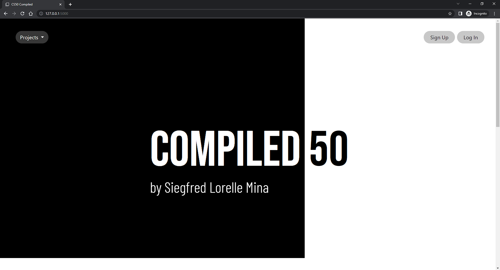
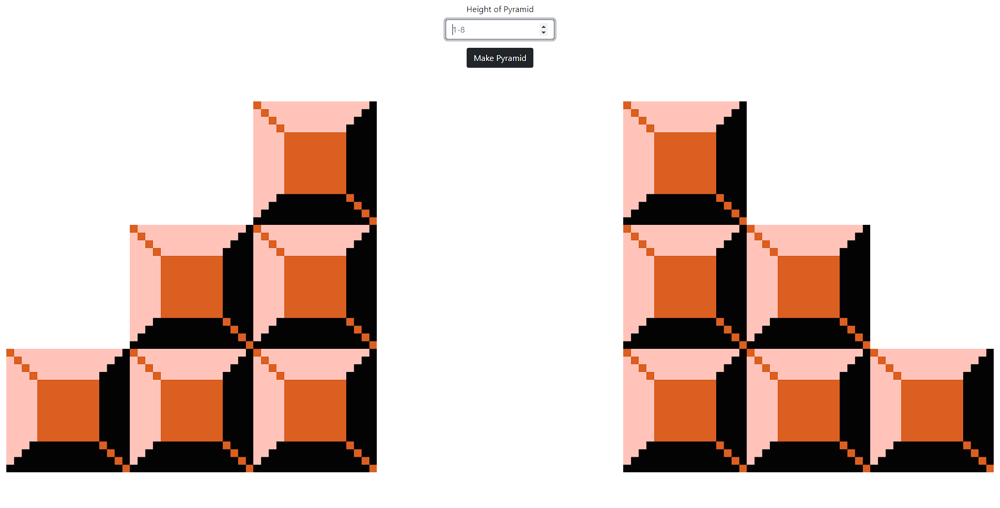
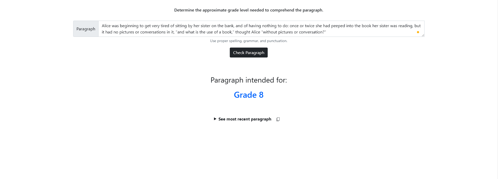
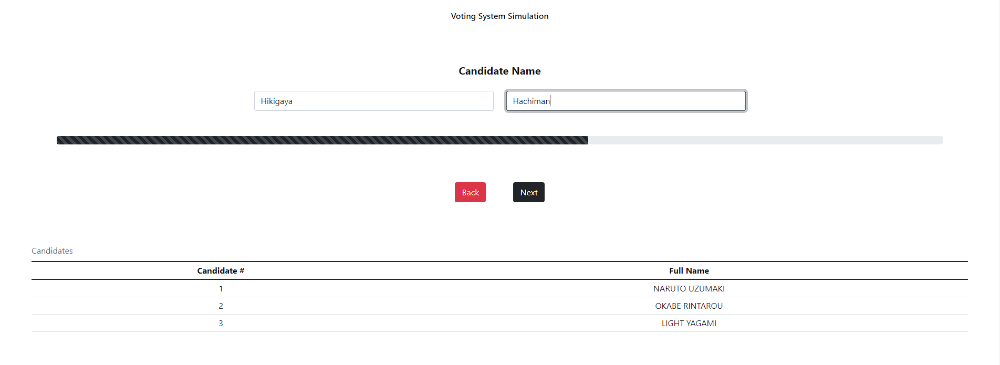
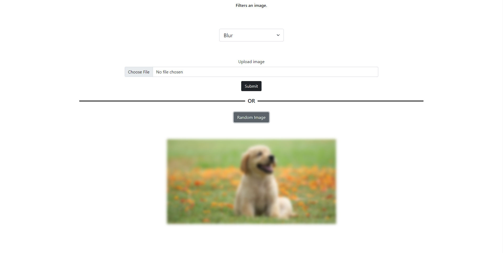
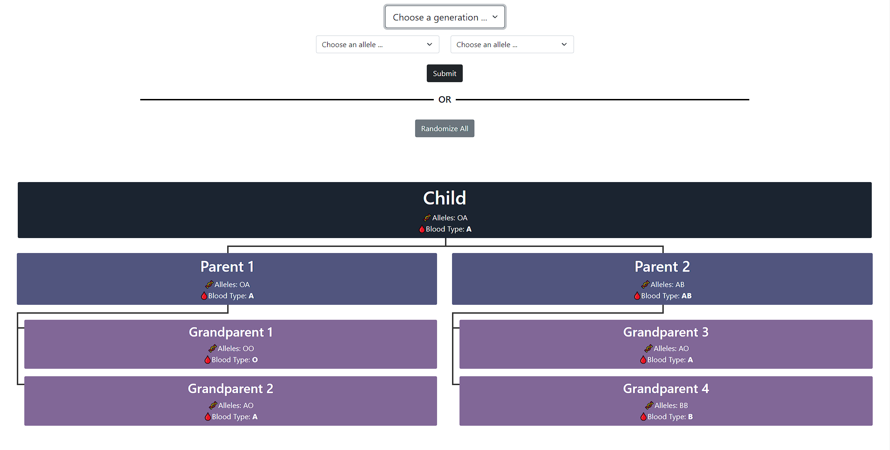
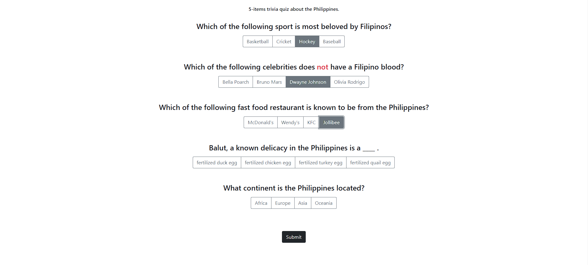
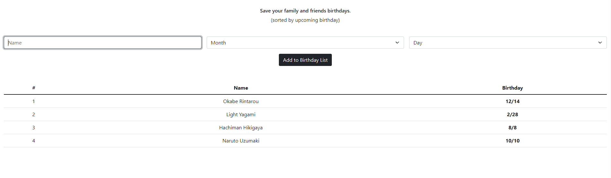

# **COMPILED 50**

#### Website Link: [Compiled 50](https://compiled-50.onrender.com/)

#### Description: A web-based application where projects from CS50x course are compiled.

---

> A CS50 Compilation and more!



---

### Table of Contents

- [Description](#description)
  - [Technologies](#technologies)
  - [Compiled Projects](#compiled-projects)
- [How to Use](#how-to-use)
  - [Installation](#installation)
  - [Configuration](#configuration)
- [Compiled Projects Details](#compiled-projects-details)
  - [Mario](#mario)
  - [Credit](#credit)
  - [Scrabble](#scrabble)
  - [Readability](#readability)
  - [Substitution](#substitution)
  - [Plurality](#plurality)
  - [Filter](#filter)
  - [Inheritance](#inheritance)
  - [Trivia](#trivia)
  - [Birthday](#birthday)
- [Other Features](#other-features)
  - [Account](#account)
  - [Contact Us](#contact-us)
  - [Aesthetics](#aesthetics)
    - [Responsive](#responsive)
    - [Color Based on Mouse Position](#color-based-on-mouse-position)
    - [Copyright Year](#copyright-year)
    - [Favicon](#favicon)
    - [Fonts and Icons](#fonts-and-icons)
- [Credits and References](#credits-and-references)
- [Author Info](#author-info)


---

## Description

It is a responsive web-based application where most project from [CS50x 2022 course](https://cs50.harvard.edu/x/2022/) are compiled. Compiled projects are given a graphical interface with additional/different features. It has a ['login' system](#account) which requires users to log in before accessing and trying out the compiled projects. Although logging in as 'guest' works too. A ['contact us' feature](#contact-us) allows user to send message to the developers via email. Compiled projects consist of 10 projects derived from labs and problem sets of CS50x 2022.

#### Technologies

- Python 3.10
- Flask 2
- SQLite 3
- Bootstrap 5.1
- HTML, CSS, JavaScript

#### Compiled Projects

- [Mario](#mario)
- [Credit](#credit)
- [Scrabble](#scrabble)
- [Readability](#readability)
- [Substitution](#substitution)
- [Plurality](#plurality)
- [Filter](#filter)
- [Inheritance](#inheritance)
- [Trivia](#trivia)
- [Birthday](#birthday)

[&#9650; Go Back Top](#compiled-50)

---

## How to Use

#### Visit in the Web

Website Link: [Compiled 50](https://compiled-50.onrender.com/)

#### Install & Configure your own Compiled 50
##### Installation

  - Fork [this repository](https://github.com/SiegfredLorelle/compiled-50). [(Not sure how?)](https://docs.github.com/en/get-started/quickstart/fork-a-repo#forking-a-repository)

  - Install [python](https://www.python.org/downloads/) and pip. [(Not sure how?)](https://pip.pypa.io/en/latest/installation/#installation)

  - Install necessary [python packages](https://github.com/SiegfredLorelle/compiled-50/blob/main/requirements.txt) using pip. [(Not sure how?)](https://pip.pypa.io/en/latest/getting-started/#install-multiple-packages-using-a-requirements-file)

  - Try running the command below on the root directory.

    ```
    flask run
    ```

  - If an error occurs, try following the steps again.

[Back to the Top](#compiled-50)

##### Configuration

  Your Compiled 50 should work after [installing](#installation). However the ['contact us' feature](#contact-us) won't send the message/email to you. Mail server must be configured that the username and password is from your email. To do this:

  - Add 2-Step Verification on the Google Account you want to receive the message. [(Not sure how?)](https://support.google.com/accounts/answer/185839?hl=en&co=GENIE.Platform%3DDesktop)

  - Create an App Password. The given 16-character code will be the password for your the mail server. [(Not sure how?)](https://support.google.com/mail/answer/185833?hl=en)

  - Create an OS environment variable for username and password [(Windows)](https://docs.oracle.com/en/database/oracle/machine-learning/oml4r/1.5.1/oread/creating-and-modifying-environment-variables-on-windows.html#GUID-DD6F9982-60D5-48F6-8270-A27EC53807D0) [(Linux)](https://linuxize.com/post/how-to-set-and-list-environment-variables-in-linux/#persistent-environment-variables). Make sure the variable name for username is 'COMPILED50_USERNAME' and variable name for password is 'COMPILED50_PASSWORD'.
    The environment variable should look like below.
    ```
    COMPILED50_USERNAME=YourGmail@gmail.com
    COMPILED50_PASSWORD=abcdefghijklmnop
    ```

  - Try sending a message using the 'Contact Us' feature, then check if the email has been sent to your gmail.

[&#9650; Go Back Top](#compiled-50)

---

## Compiled Project Details

- #### **Mario**

  Mario is derived from [CS50x 2022 Problem Set 1](https://cs50.harvard.edu/x/2022/psets/1/mario/more/). This follows the 'feeling more comfortable' version of Mario. It works exactly the same as the problem set. Height is limited to 1-8 inclusive. The main difference is that the blocks are reperesented as an actual image from [Super Mario Bros.](https://mario.nintendo.com/history/) in the web-app, instead of printing '#' in command line.

  

  [&#9650; Go Back Top](#compiled-50)

- #### **Credit**

  Credit is derived from [CS50x 2022 Problem Set 1](https://cs50.harvard.edu/x/2022/psets/1/credit/). It also works exactly the same as the problem set. It also utilizes [Luhn's Algorithm](https://www.geeksforgeeks.org/luhn-algorithm/) to determine the validity of the card. It shows the type of credit card and a sample image of it.

  The added feature here is a 'Not sure what to enter?' dropdown. The dropdown shows sample American Express (AMEX), Mastercard, and Visa credit card numbers. Beside each credit card number is a 'copy' button. Hovering the copy button triggers a tooltip saying 'copy'. Clicking the copy button automatically copy the credit card number it is assign to (or just beside it) as clipboard and automatically type the credit card number in the credit card number input box. A javascript alert informs the user about the automatic copy-paste of the credit card number.

  The downside of Credit is that it is limited to the given constraints of the problem set. Card types does not always align with the given conditions, there are always exceptions. For example, according to the problem set, MasterCard starts with numbers from 51-56, but according to [PayPal](https://developer.paypal.com/api/nvp-soap/payflow/integration-guide/test-transactions/#standard-test-cards) some MasterCard starts at 2.

  

  [&#9650; Go Back Top](#compiled-50)

- #### **Scrabble**

  Scrabble is derived from [CS50x 2022 Lab 2](https://cs50.harvard.edu/x/2022/labs/2/). It works slightly different from the lab. This only asks one word from the user, instead of asking two words in the lab. It only shows the total score of given word (with each letters' score), instead of comparing the score of the two words in lab. It is also stricter in terms of accepting words. Before showing the score of the word, it verifies the validity of the world by checking it to a dictionary. The dictionary used is the large dictionary from [CS50x 2022 Week 5 Problem Set 5: Speller](https://cs50.harvard.edu/x/2022/psets/5/speller/).

  

  [&#9650; Go Back Top](#compiled-50)

- #### **Readability**

  Readability is derived from [CS50x 2022 Problem Set 2](https://cs50.harvard.edu/x/2022/psets/2/readability/). It works similar to the problem set. The readability test used is [Coleman-Liau Index](https://readable.com/readability/coleman-liau-readability-index/) which considers the number of letters, words, and sentences of the paragraph. It will show the approximate grade level needed to comprehend the given paragraph.

  The added feature here is similar to credit, a 'Not sure what to enter?' dropdown. The dropdown shows a list different grade levels with a 'copy' button beside. Clicking a grade level, shows a sample paragraph intended for that grade level. Hovering the 'copy button triggers a tooltip saying 'copy'. Clicking the copy button, automatically copies the paragraph assigned to (under) the grade level as clipboard and automatically paste the copied paragraph in the paragraph input box. A javascript alerts informs the user about the automatic copy-paste of the paragraph.

  A downside of using readability is its lack of validity checks. Any character, including digits, special characters, characters from other languages, are accepted as letter which can affect accuracy of the results. Considering the readability test used is intended only for the English language.

  

  [&#9650; Go Back Top](#compiled-50)
  
- #### **Substitution**

  Substitution is derived from [CS50x 2022 Problem Set 2](https://cs50.harvard.edu/x/2022/psets/2/substitution/). it is similar to the problem set, key difference is that this has a function to decrypt. The encryption works by mapping the given key (sequence of 26 distinct letters) to the English alphabet. It allows user to encrypt or decrypt, instead of just encrypt in the problem set. If the user decided to encrypt, the result is the cipher-text of the given plain-text. If the user decided to decrypt, the result is the plain-text of the given cipher-text.

  Another additional feature is similar to credit and readability, a 'Not sure what to enter?' dropdown. The dropdown shows a list of different keys with each having a copy button beside it. Hovering the copy button, triggers a tooltip saying 'copy'. Clicking the copy button, copies the key assigned to (beside) it as clipboard and paste the copied key to the key input box. A javascript alert informs the user about the automatic copy-paste of the paragraph.

  The downside of substitution is that entering with incorrect/lacking inputs will clear the input boxes. A possible fix would be to check the inputs from the front-end using javascript, preventing incorrect/lacking inputs to reach the back-end (flask).

  

  [&#9650; Go Back Top](#compiled-50)

- #### **Plurality**

  Plurality is derived from [CS50x 2022 Problem Set 3](https://cs50.harvard.edu/x/2022/psets/3/). It works similar to the problem set. It is divided into three steps. The first step asks for the number of candidates and voters.

  The next step asks for the name of each candidates. It checks the validity of the name by ensuring that the given name does not contains a digit or that it is duplicate. The progress bar represents the progress in naming the candidates. An empty bar means no candidate has been named. A full bar means all candidates have been named. The next step starts, if all candidates have been named.

  The next step is voting phase. Each voters cast their vote by selecting the name of the candidate. Similar to the previous step, a progress bar is present. The progress bar represent the progress in voting. Empty bar means no votes has been cast yet. Full bar means all voters have casted their votes. The result can be seen in a table below, updating with each cast of votes. If all voters have voted, then the winner will be presented. User can also see the final tally of votes by clicking the 'see result' button.

  

  [&#9650; Go Back Top](#compiled-50)
  
- #### **Filter**

  Filter is derived from [CS50x 2022 Problem Set 4](https://cs50.harvard.edu/x/2022/psets/4/filter/less/). It follows the 'less comfortable' version of Filter. All features from the problem set is present. The four (4) filters available are grayscale, sepia, reflection, and blur. 

  The additional feature here is that it allows user to upload any images (assuming its file extension is valid). For users hesitant to upload an image, there is also a 'random image' button. Clicking random image button opens up 4 images of dogs. Selecting one of them applies the selected filter to the selected image.

  Editing images manually via bitmaps in the problem set is far more complicated than using CSS filers and transforms.

  

  [&#9650; Go Back Top](#compiled-50)

- #### **Inheritance**

  Inheritance is derived from [CS50x 2022 Lab 5](https://cs50.harvard.edu/x/2022/labs/5/). It works similar to the lab. Although this gives the user an option to select a generation and its alleles. 'Randomize all' button exists which works the same as lab. Clicking randomize all button randomizes both alleles of the all grandparents. And parent and child must inherit one allele from each of their parents randomly.

  A downside of inheritance is its implementation. The code could use a more efficient algorithm and a better data structure instead of using conditionals to all possible outcomes.

  

  [&#9650; Go Back Top](#compiled-50)

- #### **Trivia**

  Trivia is derived from [CS50x 2022 Lab 8](https://cs50.harvard.edu/x/2022/labs/8/). The lab itself give us freedom to aks any questions that we want. I personalize it to be a 5 item quiz about the [Philippines](https://en.wikipedia.org/wiki/Philippines). There are 7 multiple choice questions in the pool of questions. Only 5 from the 7 questions are going to be asked. The probability of each question being picked from the pool is random. Clicking submit redirects to the result page. But users must answer all items before the it proceeds to the result page.

  The result page shows the score of user out of 5. Score below 3 are rated as failed. A score of 3 or 4 is rated as passing. And a 5 out of 5 score is rated as perfect. If user has mistakes, a 'see mistakes' button is present. Clicking see mistake button, will show all items answered incorrectly. The user's answer is highlighted as red, and the correct answer is highlighted as green. There are two small dots on top labeled as legends. Hovering the green dot, triggers a tooltip saying 'correct answer.' Hovering red dot, triggers a tooltip saying 'your answer.'

  

  [&#9650; Go Back Top](#compiled-50)

- #### **Birthday**

  Birthday is derived from [CS50x 2022 Lab 9](https://cs50.harvard.edu/x/2022/labs/9/). It works similar to the lab. Enter the name, birth month, and birth day of a person to add them to the birthday lists. The list is sorted by upcoming birthday. It has date check feature which ensures that the month date is valid. Hovering on a row of the birthday list displays an 'X' remove button on its right. Clicking the remove button removes that person on the birthday lists. If users logged in as 'guest', their birthday list resets as soon as they logged out.

  The downside of birthday is in the implementation of sorting by upcoming date. There seems to be bug where sometimes it does not sort it properly. Adding more person or refreshing the page fixes the bug.

  

  [&#9650; Go Back Top](#compiled-50)

---

## Other Features

- #### **Account**

  In order to access the compiled projects, users must login a registered account. If user does not have a registered account, users may sign up to create an account or login as 'guest.' 

  Registering an account, requires a username and password. When logged in, users can manage their account details, allowing them to change their username or password.

  [&#9650; Go Back Top](#compiled-50)

- #### **Contact Us**

  Users may click 'contact us' button on the footer. It opens a modal prompting for a message for the developers. The message is sent via email.

  [&#9650; Go Back Top](#compiled-50)
  
- #### **Aesthetics**

  - ##### **Responsive**

    The web-app responds to size of screen or orientation. Larger (in terms of horizontal length) screens have different layout than smaller screens. Layout is adjusted to give a better user interface that fits the user's screen. It tries to give the same experience for large screen and small screen users.

  - ##### **Color Based on Mouse Position**

    On homepage, the background color changes based on the mouse position. On the left side of the mouse, the background color is black and text color is white. On the right side of the mouse, the background color is white and the text color is black. Left side elements of the homepage are stacked on top of the right side elements. A javascript file, 'mouse-track.js', tracks the position of mouse (also tracks touches for mobile users) and get the current width, then apply that width to as style to the elements designated to the left side. That way the width of the elements of the left side are limited to the current position of the mouse which puts the right side elements on top only on the right side of the mouse.

  - ##### **Copyright Year**

    At the footer of every page is a copyright symbol, year, and the developer's name. The year is entered using javascript. Javascript gets the current full year and enter it in the footer. That way the year should change automatically based on the current year. Lessening the maintenance needed.

  - ##### **Favicon**

    The favicon used for the web-app is an [icon from Google Fonts](https://fonts.google.com/icons?icon.query=filter+none&icon.style=Rounded). The favicon color is dependent on the theme of the browser. A light theme browser uses a black favicon. A dark theme browser uses a white favicon. 

  - ##### **Fonts and Icons**

    Plenty of icons and fonts used in the web-app are from [Google Fonts](https://fonts.google.com/). Icons includes favicon, copy button, and info button. Each compiled project has a different font for its title. The font style of the the title of the web-app, Compiled 50, is [Bebas Neue](https://fonts.google.com/specimen/Bebas+Neue?query=bebas).

  [&#9650; Go Back Top](#compiled-50)

---

## Credits and References

- [Bootstrap Documentation](https://getbootstrap.com/docs/5.1/getting-started/introduction/)
- [Google Fonts](https://fonts.google.com/)
- [Color Based on Mouse Position](https://www.youtube.com/watch?v=zGKNMm4L-r4)
- [Mario Block](http://pixelartmaker.com/art/d53cda86152db67)
- [Credit Card Template](https://www.figma.com/community/file/934454786523964614)
- [American Express (AMEX) Logo](https://www.pngegg.com/en/png-pswlb)
- [Scrabble Tile Template](https://thekatespanos.com/scrabble-score-calculator/)
- [First Dog in Filter](https://www.google.com/imgres?imgurl=https%3A%2F%2Fhips.hearstapps.com%2Fhmg-prod.s3.amazonaws.com%2Fimages%2Fdog-puppy-on-garden-royalty-free-image-1586966191.jpg&imgrefurl=https%3A%2F%2Fwww.goodhousekeeping.com%2Flife%2Fpets%2Fg4531%2Fcutest-dog-breeds%2F&tbnid=k9xReEDKDkeNKM&vet=12ahUKEwiSxbir04r8AhVEUN4KHe_VBUoQMygFegUIARDqAQ..i&docid=2r6Arj4-hBjhNM&w=1999&h=1499&q=dogs&ved=2ahUKEwiSxbir04r8AhVEUN4KHe_VBUoQMygFegUIARDqAQ)
- [Second Dog in Filter](https://www.google.com/imgres?imgurl=https%3A%2F%2Fmedia.npr.org%2Fassets%2Fimg%2F2022%2F05%2F25%2Fgettyimages-917452888-edit_custom-c656c35e4e40bf22799195af846379af6538810c-s1100-c50.jpg&imgrefurl=https%3A%2F%2Fwww.npr.org%2F2022%2F05%2F25%2F1101178609%2Fdog-breeds-are-a-behavioral-myth-sorry&tbnid=eZ7z5QKRWWfQjM&vet=10CBkQMyh0ahcKEwigitGr04r8AhUAAAAAHQAAAAAQAw..i&docid=h1VgN3JK54ZzrM&w=1100&h=761&q=dogs&ved=0CBkQMyh0ahcKEwigitGr04r8AhUAAAAAHQAAAAAQAw)
- [Third Dog in Filter](https://www.google.com/imgres?imgurl=https%3A%2F%2Fwww.aspca.org%2Fsites%2Fdefault%2Ffiles%2Fdog-care_general-dog-care_main-image.jpg&imgrefurl=https%3A%2F%2Fwww.aspca.org%2Fpet-care%2Fdog-care%2Fgeneral-dog-care&tbnid=5Ltzy9NuXgAbHM&vet=10CHcQMyieAWoXChMIoIrRq9OK_AIVAAAAAB0AAAAAEAM..i&docid=ERlyPt0D7ftS3M&w=1040&h=500&q=dogs&ved=0CHcQMyieAWoXChMIoIrRq9OK_AIVAAAAAB0AAAAAEAM)
- [Fourth Dog in Filter](https://www.google.com/search?q=why-shiba-inu-was-falling-today&sxsrf=ALiCzsZcxwM-IhxRL9SnCh0_DxoUAvF0LQ:1671624372753&source=lnms&tbm=isch&sa=X&ved=2ahUKEwj19L2H1or8AhUPMd4KHR5-DtMQ_AUoA3oECAEQBQ&biw=1920&bih=969&dpr=1#imgrc=2iE49j6FZZy4zM)
- [Family Tree in Inheritance](https://www.cssscript.com/responsive-hierarchical-organization-chart-pure-css/)

[&#9650; Go Back Top](#compiled-50)

---

## Author Info
- Github - [SiegfredLorelle](https://github.com/SiegfredLorelle)

- Facebook - [Siegfred Mina](https://www.facebook.com/profile.php?id=1718881634)

- LinkedIn - [Siegfred Lorelle Mina](https://www.linkedin.com/in/siegfred-lorelle-mina)

[&#9650; Go Back Top](#compiled-50)